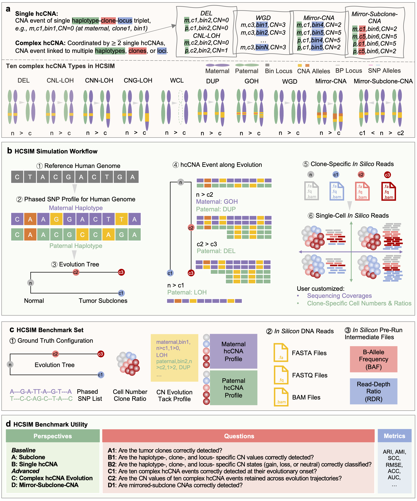

# HCSIM: A Single-Cell Genomics Simulator with Haplotype-Specific Copy Number Annotation.

HCSIM: A Single-Cell Genomics Simulator with Haplotype-Specific Copy Number Annotation. Read the full [documentation] here.

<!-- ## Citation

If you use `hcsim` in your work, please cite the `hcsim` publication as follows:

> to do -->

[documentation]: https://hcsim.readthedocs.io
